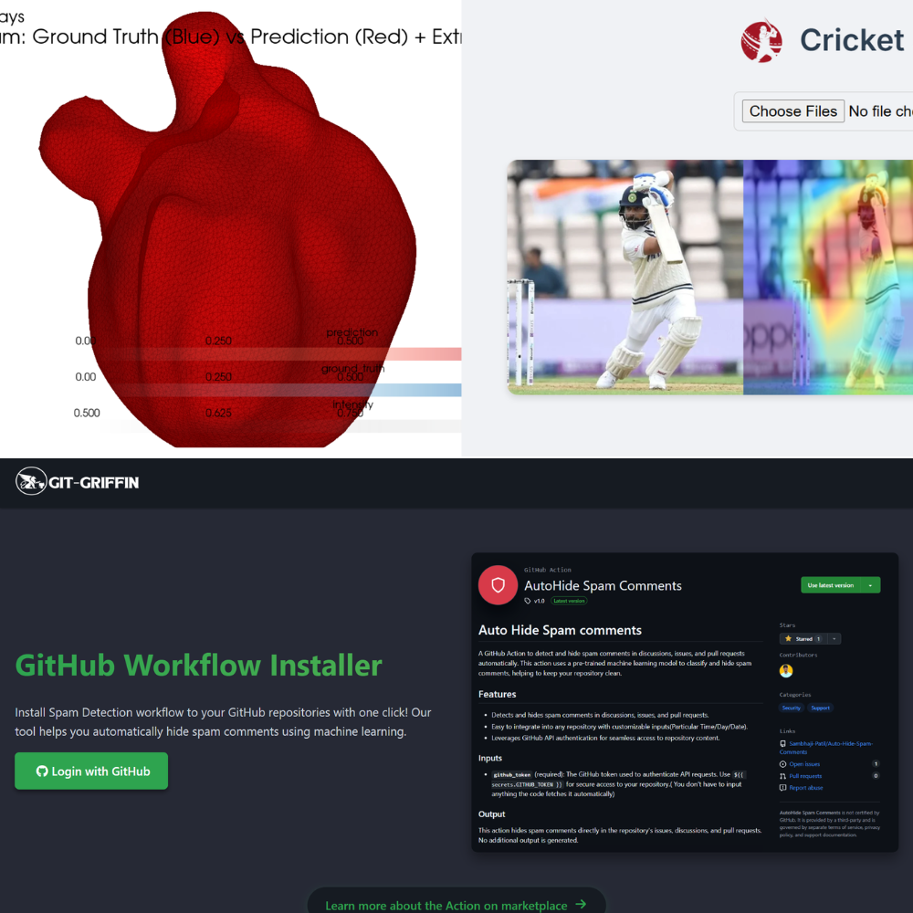

<h1 align="center">Hey there! 👋 I'm Sambhaji</h1>
<h3 align="center">🚀 Curious CSE Undergrad | 💡 AIML Explorer </h3>

  

### 🟢 The Short Version
---

> A CSE undergrad who loves turning **AI concepts into working systems** — from spam detection to multimodal medical diagnostics.  
> I like my models lean, my code clean, and my goals a bit out of reach.

- 💡 Currently exploring **AI/ML + Computer Vision + LLMOps**
- 🧠 Practicing **DSA in C++** to sharpen my problem-solving reflexes  
- ⚡ Active in **hackathons**, building tools that *actually matter*  
- 🌍 Passionate about **open-source**, scalable design, and impact-driven AI

<h3 align="left">🟢 Tech Stack</h3>

<table>
  <tr>
    <td align="center">
      <h4>⚙️ Languages & Frameworks</h4>
      
      
      
      
    </td>
    <td align="center">
      <h4>🧠 AI/ML & Tools</h4>
      
      
      
      
      
    </td>
    <td align="center">
      <h4>🗄️ Databases & Dev Tools</h4>
      
      
      
      
      
    </td>
  </tr>
</table>

### 🟢 Featured Work
---

<table>
  <tr>
    <td width="60%" valign="center">

📦 **[GitHub Spam Detection Action](https://github.com/Sambhaji-Patil/Auto-Hide-Spam-Comments)**  
_Auto-flags spam in issues, discussions & PRs using a Naive Bayes model._
Integrated into CI workflows via GitHub Actions and personalized using Supabase feedback.

🩺 **[Heart Segmentation](https://github.com/Sambhaji-Patil/Heart_Segmentation)**  
_Segmentation of the left atrium from volumetric CT scans using a custom 3D U-Net architecture._

⚙️ **[FastAPI + RAG System (HackRx 6.0)](https://github.com/Sambhaji-Patil/Multi-Doc-RAG)**  
_A retrieval-augmented generation system with Qdrant, LLaMA, and custom document parsers._

  </td>
  <td width="40%" align="center">
    
  </td>
  </tr>
</table>

### 🟢 GitHub Stats
---

 
  <table> 
    <tr> 
      <td align="center">  
      </td> <td align="center">  
      </td> <td align="center">  
      </td> 
    </tr> 
  </table> 

### 🟢 GitHub Trophies
---

  

### 🟢 Connect with Me
---

  
  

  

